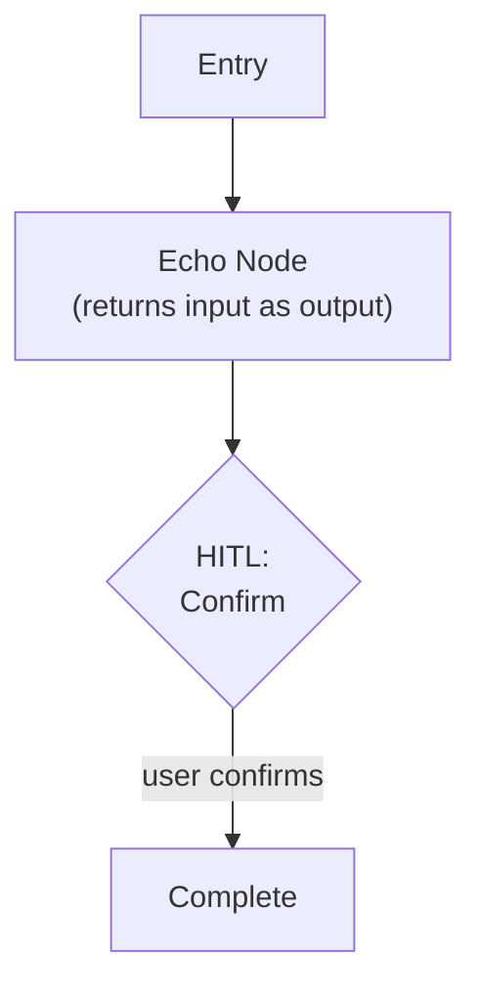
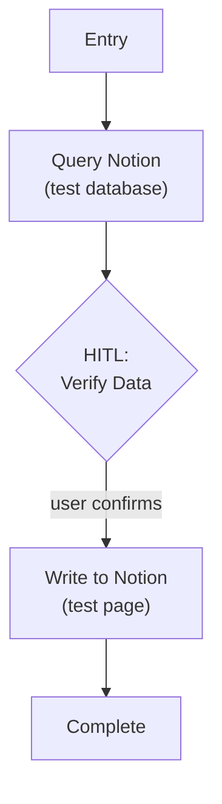
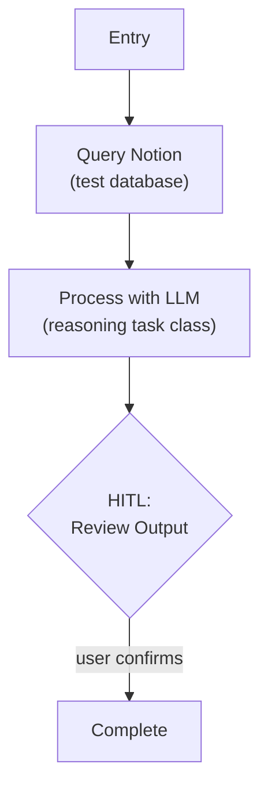
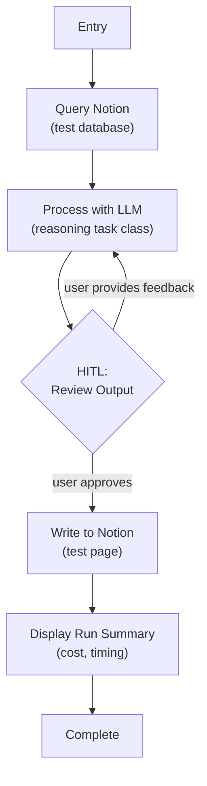

# System Overview & Architecture

## 1. System Overview & Legacy Context

The Weekforge project is currently empty. The `source-material` folder contains legacy declarative text-based recipes that were used manually with Claude Code. The overarching goal is to fundamentally upgrade the system into a robust, deterministic, and highly reliable graph-based application using **LangGraph**, without expanding the current feature scope unnecessarily.

This migration will introduce advanced Agentic Patterns, optimize token usage via Python tooling, construct a rich local CLI environment, and employ model-agnostic routing to balance cost and cognitive power natively.

**Agentic Complexity Level: 2 — Strategic Problem-Solver** (per Agentic Design Patterns Guide §2). Weekforge uses **Context Engineering** as a systematic discipline — strategically curating the model's context through PLAN_STATE, 3-week feedback windows, and summary-first loading to prevent cognitive overload and ensure efficient performance. It implements automated feedback loops (Evaluator-Optimizer) for self-improvement of output quality. It does **not** reach Level 3 (Collaborative Multi-Agent) — there is a single reasoning agent, not multiple specialized agents. This is intentional: multi-agent coordination adds complexity without benefit for a single-user, single-domain workflow.

## 2. Global System Architecture & Intelligence Routing

### Intelligence Tiering & Task Abstraction

The backend will utilize an abstraction layer to rapidly test and swap between different LLM providers. Intelligence is tiered:

- **Tier 0 (Pure Python, Zero LLM):** All database querying, data formatting, structural validation, and deterministic logic. Tool nodes, the Deterministic Evaluator (§3 Evaluator-Optimizer, Stage 1), and state management live here. This tier is where cost savings come from — every operation that *can* be Python *must* be Python.
- **Tier 1 (Cheap/Fast Models):** Routing, classification, and lightweight decisions where deterministic rules aren't sufficient.
- **Tier 2 (Heavy Cognitive Models):** `plan_week`, `draft_session`, `summarize_week` — macro-planning, session generation, and feedback synthesis. Tasks requiring genuine reasoning about historical feedback vs templates.

### Generic Notion Tool Layer

All Notion interactions are encapsulated in a **reusable tool layer** — generic Python primitives that feature-specific nodes compose. This layer is Tier-0 (no LLM involvement). The LLM never touches Notion directly; it receives structured data from tools and returns structured outputs that tools write.

**Generic operations** the tool layer must support:

- **Query** — Filter a database by properties, return structured results (not raw API responses)
- **Fetch** — Retrieve a specific page's properties and block content
- **Create** — Write a new page with typed properties and markdown content
- **Update** — Mutate specific properties or replace page content on an existing page

**Design principles:**

- Tool inputs and outputs are **typed data structures**, not free text — this is what makes Tier-0 deterministic
- Notion API specifics (pagination, rate limiting, property type mapping) are hidden inside the tool layer, never leaked to the graph
- Specific tool nodes (e.g., "fetch templates by week prefix", "load 3-week feedback window") will be defined in individual feature specs, composing these generic primitives

### Execution Environment & CLI Experience

Weekforge will be designed as an **On-Demand Local CLI Tool** (run only when the user needs it). To handle LangGraph's persistent state and Human-In-The-Loop checkpoints, the CLI will use rich terminal libraries to present a premium, scannable interface.

The CLI design is grounded in the user's cognitive profile (`references/szymi-blueprint.md`). Each principle maps to a specific AuDHD/cognitive need:

**Zero-decision entry.** A single command (`weekforge`) with no arguments shows available commands and active run status if a checkpoint exists. Explicit subcommands (`weekforge plan`, `weekforge continue`) trigger specific actions. The user never needs to remember what's available — the CLI tells them. This maps to: *"Most effective tools require zero working memory"* (szymi-blueprint §5).

**Progressive disclosure.** Show summary first, expand details on request. Feedback loading displays `3 weeks loaded | flare: NO | trend: progressing` — not a wall of exercise data. The user can request expansion when they want depth. This maps to: *"Progressive disclosure — essential first, depth on request"* (szymi-blueprint §6).

**Scannable output.** Fixed, predictable section headers every time. Session drafts always have the same visual structure. Key decisions highlighted with clear visual markers. No walls of prose. This maps to: *"Chunked, scannable blocks. Predictable formatting, checkboxes, timeboxes, fixed section headers"* (szymi-blueprint §6, Claude.md).

**Clear decision points.** Every HITL pause presents exactly: (1) what you're looking at, (2) what your options are, (3) the recommended action. Not a context dump that requires the user to figure out what to do. This maps to: *"Clear decision points flagged explicitly"* (szymi-blueprint §6).

**Flow-compatible momentum.** The approve → auto-continue → next draft loop preserves flow state. No unnecessary pauses between sessions during the generation phase. Once the user is in the "generate sessions" flow, the system keeps the momentum going. This maps to: *"Deep intense bursts of flow, not steady daily output"* (szymi-blueprint §5).

**Dopamine milestones.** Session progress visualization (`3/8 ████░░░░`), completion celebrations, and clear visual feedback on what's done. Small wins surfaced throughout the workflow. This maps to: *"Provide dopamine milestones"* (szymi-blueprint §5).

**Refinement over generation.** The system always proposes first, then the user refines. Never ask "what do you want?" — instead present a draft and ask "what would you change?" This maps to: *"Refinement over generation — present a draft, let him refine"* (szymi-blueprint §6).

### User Configuration & Variable Storage

To support varied configurations, **user profiles and guardrails will be stored directly in Notion**. A `ConfigLoader` node fetches this data at runtime to hydrate the pipeline.

## 3. Notion Tool Layer: Interface Contracts

The four generic operations described in §2 are specified here with typed contracts. All types use language-agnostic pseudo-types. The tool layer is Tier-0 — pure deterministic code, no LLM involvement.

### Operations

**query(database_id, filters) → list[record]**

| Parameter | Type | Description |
|-----------|------|-------------|
| `database_id` | `string` | Notion database identifier |
| `filters` | `list[filter_condition]` | Property-based filter conditions |
| **Returns** | `list[record]` | Structured records with typed property values |

Pagination is handled internally — callers always receive the complete result set. The tool layer iterates Notion's cursor-based pagination transparently.

**fetch(page_id) → page**

| Parameter | Type | Description |
|-----------|------|-------------|
| `page_id` | `string` | Notion page identifier |
| **Returns** | `page` | Page object: `{ properties: map[string, typed_value], content: list[block] }` |

Block content is parsed from Notion's block tree into a flat, typed list. `to_do` blocks (used for exercise checkboxes) preserve their checked state.

**create(database_id, properties, content) → page_id**

| Parameter | Type | Description |
|-----------|------|-------------|
| `database_id` | `string` | Target database |
| `properties` | `map[string, typed_value]` | Typed property values matching database schema |
| `content` | `string` (markdown) | Page body as markdown, converted to Notion blocks internally |
| **Returns** | `string` | Created page ID |

**update(page_id, properties?, content?) → void**

| Parameter | Type | Description |
|-----------|------|-------------|
| `page_id` | `string` | Target page |
| `properties` | `map[string, typed_value]` (optional) | Properties to update (partial — unspecified properties are untouched) |
| `content` | `string` (markdown, optional) | Replacement body content |

Update operations are **idempotent** — calling update with the same data multiple times produces the same result. This is critical for crash safety (see WF-03).

### Error Contract

All operations return structured errors, never raw exceptions. Errors are categorized:

| Error Category | Description | Tool Layer Behavior |
|---------------|-------------|--------------------|
| `not_found` | Page or database does not exist | Return error immediately |
| `rate_limited` | Notion API rate limit hit | Retry with exponential backoff (1s → 2s → 4s), transparent to caller |
| `auth_failed` | Invalid or expired token | Return error immediately — unrecoverable |
| `api_error` | Other Notion API errors | Return error with original message |

Rate limiting is the only error with automatic retry. All other errors surface to the calling node for graph-level handling (see WF-03 Failure Modes).

## 4. Model Configuration Layer

Weekforge uses **LangGraph-native model binding** — nodes bind to LangChain `ChatModel` instances directly. There is no custom wrapper around LLM calls. The abstraction layer is a **configuration layer** that controls which model serves which task class.

### Task Classes

Instead of opaque tier numbers, the configuration interface uses descriptive task class names:

| Task Class | Maps to | Purpose | Phase 0 Default |
|-----------|---------|---------|----------------|
| `deterministic` | Tier 0 | Pure Python, no LLM | N/A (no model needed) |
| `fast` | Tier 1 | Routing, classification, lightweight decisions | `gpt-5.4-nano` |
| `reasoning` | Tier 2 | Planning, generation, synthesis — genuine reasoning | `gpt-5.4` |

The core specs (WF-01 through WF-03) continue to reference Tier-0/1/2 for architectural discussion. The task class names are the interface developers use when configuring nodes.

### Configuration Structure

```
models:
  fast:
    provider: openai
    model: gpt-5.4-nano
    reasoning: medium
    temperature: 0.1
  reasoning:
    provider: openai
    model: gpt-5.4
    reasoning: medium
    temperature: 0.7
```

Swapping a model means changing one config entry. Node code references task classes (`fast`, `reasoning`), never specific model names.

### Response Metadata

Every LLM call returns metadata alongside the response:

| Field | Type | Description |
|-------|------|-------------|
| `model_used` | `string` | Actual model identifier (e.g., `gpt-4o-2024-08-06`) |
| `latency_ms` | `integer` | Wall-clock time for the call |
| `input_tokens` | `integer` | Prompt token count |
| `output_tokens` | `integer` | Completion token count |
| `estimated_cost` | `float` | Estimated cost in USD based on current pricing |

This metadata is the foundation for the observability system (WF-OBS). Basic per-call metadata is captured here; aggregation and analysis are defined in WF-OBS.

### Run-Level Cost Accumulation

A `run_cost` field in graph state accumulates estimated cost from every LLM call during a graph run. The CLI displays the total cost at run completion. This provides immediate cost visibility without requiring the full WF-OBS infrastructure.

## 5. CLI Architecture

### Library Stack

- **Typer** — Command routing, argument parsing, auto-generated help text
- **Rich** — Output formatting: tables, progress bars, panels, markdown rendering, syntax highlighting

Typer is built on Click and provides the simplest command definition interface for a single-developer CLI. Rich handles all the AuDHD-friendly output principles defined in §2.

### Command Structure

| Command | Behavior |
|---------|----------|
| `weekforge` | Show available commands + active checkpoint status if a run exists |
| `weekforge plan` | Start or resume the planning lifecycle (Lifecycle A) |
| `weekforge summarize` | Start or resume the extraction lifecycle (Lifecycle B) |
| `weekforge continue` | Resume from the last checkpoint (any lifecycle) |

Additional commands will be defined in feature specs as lifecycles are implemented.

### HITL Presentation Pattern

Every Human-In-The-Loop interrupt renders a Rich panel with three sections:

1. **Context** — What you're looking at (e.g., "Week 7 Macro Plan" or "Session 3/8: Upper Pull")
2. **Options** — What you can do (e.g., `[a]pprove`, `[f]eedback`, `[q]uit`)
3. **Recommendation** — What the system suggests (e.g., "All checks passed. Approve?")

### Output Formatting

| Content Type | Rich Component |
|-------------|----------------|
| Structured data (sessions, feedback) | `Table` |
| Session drafts, summaries | `Markdown` renderer |
| Decision points (HITL) | `Panel` with bordered sections |
| Progress tracking | `Progress` bar (`3/8 ████░░░░`) |
| Errors and warnings | `Console` markup with `[red]` / `[yellow]` |
| Run completion | Cost summary + session count in `Panel` |

## 6. Secrets Management & Environment Configuration

### Secret Storage

All secrets are stored in a `.env` file at the project root, loaded at application startup via environment variables. The `.env` file is **never committed to version control**.

### Repository Files

- **`.env`** — Contains actual secret values. Listed in `.gitignore`.
- **`.env.template`** — Committed to the repo. Contains all required variable names with placeholder values and explanatory comments. Serves as documentation for contributors.

### Phase 0 Required Variables

```
# .env.template

# === Notion API ===
NOTION_TOKEN=your_notion_integration_token_here

# === LLM Providers ===
OPENAI_API_KEY=your_openai_api_key_here

# === Optional: Override default model config ===
# WEEKFORGE_FAST_MODEL=gpt-5.4-nano
# WEEKFORGE_REASONING_MODEL=gpt-5.4
```

### Startup Validation

On startup, the application validates that all required environment variables are present and non-empty. If any are missing, the application fails immediately with a clear error message listing the missing variables and pointing to `.env.template` for reference.

## 7. Project Tooling Standards

> This section is intentionally implementation-specific (Python). It defines build infrastructure and development workflow standards for the project.

### Python Version

- **Minimum: Python 3.13+**
- Enforced via `pyproject.toml` `requires-python` field

### Package Management: UV

- **UV** is the project and dependency manager (replaces pip, poetry, pipenv)
- `pyproject.toml` — project metadata, dependencies, tool configuration
- `uv.lock` — deterministic lock file, committed to version control
- `uv sync` — install/update all dependencies from lock file
- `uv run weekforge` — run the application through UV's managed environment

### Project Layout

```
weekforge/
├── src/
│   └── weekforge/
│       ├── __init__.py
│       ├── cli.py          # Typer application entry point
│       ├── graph/           # LangGraph graph definitions
│       ├── tools/           # Notion tool layer + other tools
│       ├── config/          # Model config, env loading
│       └── models/          # State schemas, data models
├── tests/
├── pyproject.toml
├── uv.lock
├── .env
├── .env.template
└── .gitignore
```

### Code Quality

- **Ruff** — Linting and formatting (replaces black, isort, flake8 — single tool)
- **mypy** — Static type checking in strict mode
- Configuration for both tools lives in `pyproject.toml`

### Development Workflow

1. `uv sync` — Install/update dependencies
2. `uv run weekforge` — Run the application
3. `uv run ruff check .` — Lint
4. `uv run ruff format .` — Format
5. `uv run mypy src/` — Type check
6. `uv run pytest` — Run tests

## 8. Phase 0 Validation Graph & Sub-Milestones

Phase 0 is validated through a progressive series of sub-milestones, each building on the previous. The goal is to verify all infrastructure decisions before committing to feature development.

### Sub-Milestone 0a: Minimal Graph

**Goal:** Validate LangGraph framework basics — state, nodes, checkpoints, HITL.



- Single node that echoes state back
- One `interrupt_before` for HITL
- Checkpoint persistence: close terminal → reopen → graph resumes at HITL
- **Exit criteria:** Graph runs, pauses, survives terminal close, resumes correctly

### Sub-Milestone 0b: Notion Integration

**Goal:** Validate the Notion Tool Layer — connect, query, write.



- Query a test database, display results via Rich table
- Write a test page back to Notion
- Validate all four CRUD operations work
- **Exit criteria:** Read from Notion, display to user, write back, verify in Notion UI

### Sub-Milestone 0c: LLM Integration

**Goal:** Validate the Model Configuration Layer — call OpenAI, capture metadata.



- Load data from Notion, pass to LLM with a simple prompt
- Capture and display response metadata (model, tokens, cost)
- Validate model config switching works
- **Exit criteria:** LLM processes Notion data, metadata captured, cost displayed

### Sub-Milestone 0d: Full End-to-End Loop

**Goal:** All infrastructure working together — the Phase 0 exit criteria.



- Full loop: read → process → review → write
- HITL feedback loop (approve or refine)
- Checkpoint persistence across terminal sessions
- Run cost accumulation and display
- Startup validation (secrets, config)
- **Exit criteria:** A runnable graph that loads data from Notion, passes it through an LLM node, pauses for HITL input, and writes a result back to Notion. All infrastructure decisions validated.
