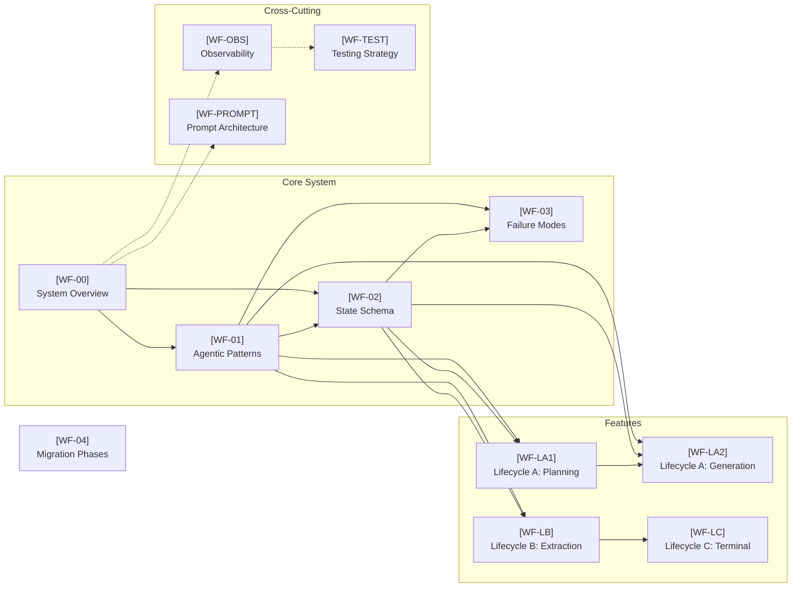

# Weekforge Specs — Status Dashboard

This is the control center for the Spec-Driven Development of Weekforge. 

> **Legend**: 
> 📝 Draft | 🔄 In Review | ✅ Approved | 🚀 Implemented | 🗑️ Deprecated

## Core Artifacts
- **[SDD Practices](../.agents/skills/specs-management/SKILL.md)** — Specs management process (project skill)
- **[Decision Log](./decision-log.md)** — Append-only record of architectural choices
- **[Traceability Matrix](./traceability-matrix.md)** — Mapping between spec features, code, and tests

## Specifications

| ID | Spec | Status | Version | Phase |
|----|------|--------|---------|-------|
| WF-00 | [System Overview](./00-system-overview.md) | 📝 Draft | 1.0 | 0 |
| WF-01 | [Agentic Patterns](./01-agentic-patterns.md) | 📝 Draft | 1.0 | 0-3 |
| WF-02 | [State Schema](./02-state-schema.md) | 📝 Draft | 1.0 | 0-3 |
| WF-03 | [Failure Modes](./03-failure-modes.md) | 📝 Draft | 1.0 | 0-3 |
| WF-04 | [Migration Phases](./04-migration-phases.md) | 📝 Draft | 1.0 | 0-4 |
| WF-LA1 | [Lifecycle A: Planning](./features/lifecycle-a-planning.md) | 📝 Draft | 1.0 | 2 |
| WF-LA2 | [Lifecycle A: Generation](./features/lifecycle-a-generation.md) | 📝 Draft | 1.0 | 3 |
| WF-LB | [Lifecycle B: Extraction](./features/lifecycle-b-extraction.md) | 📝 Draft | 1.0 | 1 |
| WF-LC | [Lifecycle C: Terminal](./features/lifecycle-c-terminal.md) | 📝 Draft | 1.0 | 4 |
| WF-OBS | [Observability](./cross-cutting/observability.md) | 📝 Draft | 0.1 | 0 |
| WF-TEST | [Testing Strategy](./cross-cutting/testing-strategy.md) | 📝 Draft | 0.1 | 0 |
| WF-PROMPT | [Prompt Architecture](./cross-cutting/prompt-architecture.md) | 📝 Draft | 0.1 | 0 |

## Dependency Graph

