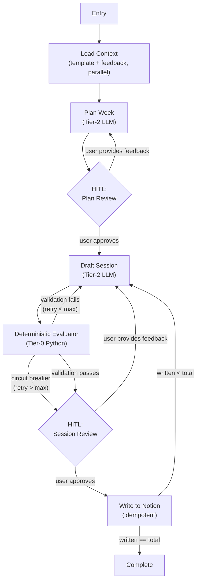

# Lifecycle A: Planning Engine (`plan_week`)

The legacy system required the user to manually trigger isolated CLI commands in exact sequence (`init` → `plan` → `draft` → `approve`). The migration optimizes this by creating a unified graph state.

Instead of typing separate commands, the system offers a unified CLI entry point. The LangGraph state machine will automatically traverse:

1. **Initialize State**
2. **Plan Macro Strategy**
   - → graph pauses for HITL review of macro plan.
   - → if user provides feedback, graph loops back to re-plan with user input (Planning pattern).
   - → if user approves, graph transitions to generation.

## Full Lifecycle A Graph Topology

> Note: This diagram covers both Planning (this spec) and Generation ([WF-LA2](./lifecycle-a-generation.md)).

## Planning Edge Conditions

The subset of edge routing representing the planning phase:

| From | To | Condition |
|------|-----|-----------|
| Entry | Load Context | Always — first node on every invocation |
| Load Context | Plan Week | Context loaded (template + feedback merged) |
| Plan Week | HITL Plan Review | Always — plan generated, interrupt for review |
| HITL Plan Review | Plan Week | User provides freeform feedback → re-plan |
| HITL Plan Review | Draft Session | User approves → begin generation |
