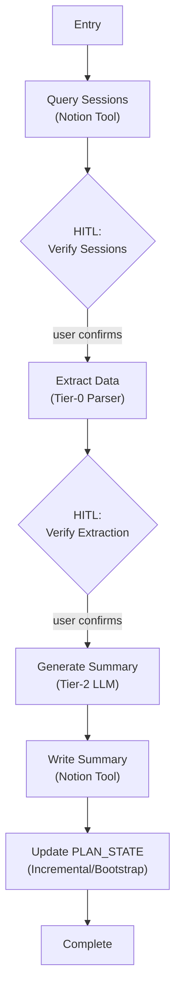

# Lifecycle B: Post-Execution Extraction (`summarize_week`)

Run completely independently on-demand after the physical training week is complete.

Aggregates the ground-truth executed sessions, extracting feedback, calculating adherence, and mutating the global `PLAN_STATE`. Retained strictly as a batch, on-demand process.

## Cross-Lifecycle Data: PLAN_STATE

PLAN_STATE is the system's **long-range memory** — a cumulative mesocycle tracker that persists in Notion across the entire 8-12 week training block. It is the bridge between Lifecycle B (which writes it) and Lifecycle A (which reads it).

**What it contains.** Progression chains for all main lifts (week-over-week weight tracking), injury timeline with onset/resolution tracking, adherence trends, deload history, focus exercise coverage gaps, cardio/climbing progression, push/pull balance, session preferences, and active vs resolved issues. It is a compressed representation of the full training history — optimized for context loading, not human reading.

**Two creation modes:**

- **Incremental update** — After each `summarize_week` run, the new week's data is merged into the existing PLAN_STATE. Each category is updated independently (e.g., append new weight to a lift's progression chain, update injury status, recalculate average adherence).
- **Bootstrap** — If PLAN_STATE doesn't exist yet (first run, or accidental deletion), it is compiled from all available weekly summaries in chronological order. This makes the system self-healing.

**Graceful degradation.** If PLAN_STATE is missing when Lifecycle A runs, the system falls back to the 3-week feedback window only. Planning and drafting still work — they just lose long-range context (e.g., mesocycle-level progression trends, historical injury patterns). The CLI should surface a warning so the user can run `summarize_week` to rebuild it.

**Storage.** Lives in the `training_week_summaries` Notion database with a special `Week = "PLAN_STATE"` key to distinguish it from regular weekly summaries.

## Graph Topology

## Edge Conditions

| From | To | Condition |
|------|-----|-----------|
| Entry | Query Sessions | Always — fetch all sessions for the target week |
| Query Sessions | HITL Verify Sessions | Sessions found — confirm correct set before extraction |
| HITL Verify Sessions | Extract Data | User confirms |
| Extract Data | HITL Verify Extraction | Data completeness check displayed |
| HITL Verify Extraction | Generate Summary | User confirms extraction is complete |
| Generate Summary | Write Summary | Summary generated (Tier-2 LLM) |
| Write Summary | Update PLAN_STATE | Summary written to Notion |
| Update PLAN_STATE | Complete | PLAN_STATE updated (incremental or bootstrap) |
