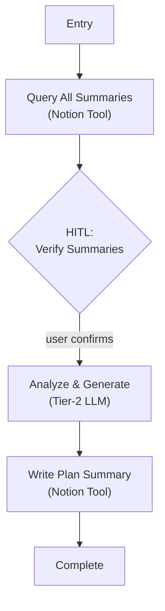

# Lifecycle C: Mesocycle Terminal Review (`summarize_plan`)

Run completely independently on-demand after a prolonged training block (8-12 weeks) is completed.

Aggregates all weekly summaries to deduce macro strength progressions and persistent pain patterns.

## Graph Topology

## Edge Conditions

| From | To | Condition |
|------|-----|-----------|
| Entry | Query All Summaries | Always — fetch all weekly summaries |
| Query All Summaries | HITL Verify Summaries | Summaries found — confirm correct set |
| HITL Verify Summaries | Analyze & Generate | User confirms |
| Analyze & Generate | Write Plan Summary | Plan summary generated (Tier-2 LLM) |
| Write Plan Summary | Complete | Written to Notion as `PLAN_SUMMARY` |
