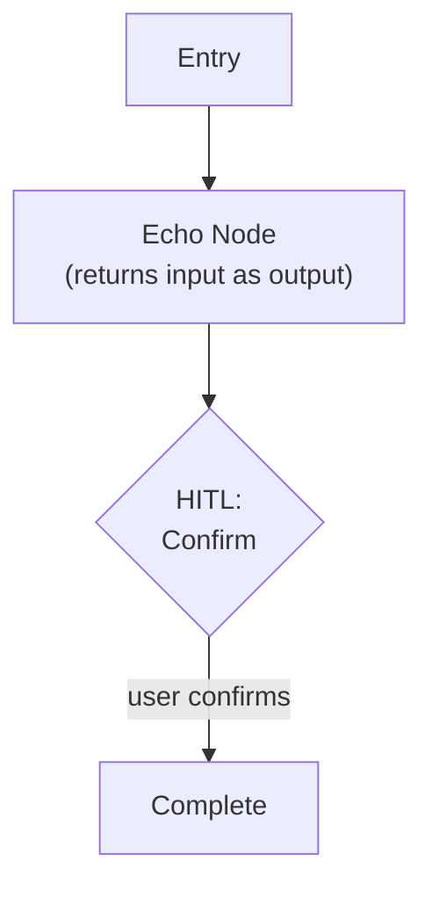

# Step 0a: Minimal Graph

## Goal

Validate LangGraph framework basics — state, nodes, checkpoints, HITL — with a trivial echo graph.

## Prerequisites

None. This is the first step.

## What You're Building

| File | Purpose |
|------|---------|
| `pyproject.toml` | Project metadata, dependencies, tool config (Ruff, mypy) |
| `.env.template` | Required env var names with placeholders |
| `.gitignore` | Standard Python + .env |
| `src/weekforge/__init__.py` | Package init |
| `src/weekforge/cli.py` | Typer entry point — `weekforge` command |
| `src/weekforge/graph/echo.py` | Minimal LangGraph graph with echo node + HITL |
| `src/weekforge/models/state.py` | Base state schema (just `message: str` for now) |

## Specification

### Project Setup

- Python 3.13+, enforced via `requires-python` in `pyproject.toml`
- UV as package manager (`uv sync`, `uv run weekforge`)
- Dependencies: `langgraph`, `typer`, `rich`
- Dev dependencies: `ruff`, `mypy`, `pytest`
- Ruff and mypy config in `pyproject.toml`

### Project Layout

```
weekforge/
├── src/
│   └── weekforge/
│       ├── __init__.py
│       ├── cli.py
│       ├── graph/
│       │   └── echo.py
│       └── models/
│           └── state.py
├── tests/
├── pyproject.toml
├── .env.template
└── .gitignore
```

### Echo Graph



- Single node that echoes state back
- One `interrupt_before` for HITL
- Checkpoint persistence using LangGraph's `SqliteSaver` (file-based, survives terminal close)
- CLI uses `thread_id` to identify runs — same thread resumes from checkpoint

### CLI Entry Point

| Command | Behavior |
|---------|----------|
| `weekforge` | Show available commands + active checkpoint status if a run exists |
| `weekforge echo` | Start or resume the echo graph (temporary — removed after step 0a) |

HITL presentation: Rich panel with Context / Options / Recommendation sections.

### Secrets & Environment

```
# .env.template
# No secrets needed for step 0a — this file will grow in later steps.
```

Startup validation: check all required env vars are present and non-empty. For 0a, this is a no-op but the validation framework should exist.

## Acceptance Criteria

- [ ] `uv sync` installs all dependencies
- [ ] `uv run weekforge` shows available commands
- [ ] `uv run weekforge echo` starts the graph, shows echo output, pauses at HITL
- [ ] User can confirm at HITL, graph completes
- [ ] Close terminal, reopen, run `weekforge echo` — graph resumes at HITL checkpoint
- [ ] `uv run ruff check .` passes
- [ ] `uv run mypy src/` passes

## Reference

- [Architecture](../reference/architecture.md) — Project layout, tooling standards, CLI principles
- [Patterns](../reference/patterns.md) — State Graph with Checkpointers (HITL)
