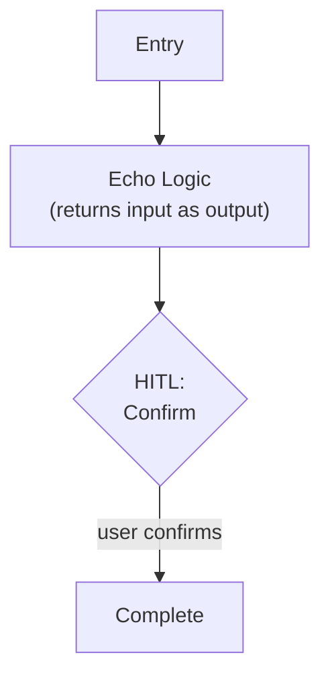

# Step 0a: Minimal Workflow

## Goal

Validate workflow basics — state, checkpoint persistence, HITL — with a trivial echo workflow. Establish the foundation modules (`checkpoint.py`, `hitl.py`) that all future workflows build on.

## Prerequisites

None. This is the first step.

## What You're Building

| File | Purpose |
|------|---------|
| `pyproject.toml` | Project metadata, dependencies, tool config (Ruff, mypy) |
| `.env.template` | Required env var names with placeholders |
| `.gitignore` | Standard Python + .env + .weekforge/ |
| `src/weekforge/__init__.py` | Package init |
| `src/weekforge/cli.py` | Typer entry point — `weekforge` command |
| `src/weekforge/checkpoint.py` | SQLite checkpoint store for workflow persistence |
| `src/weekforge/hitl.py` | HITL presentation helpers (Rich panels + input) |
| `src/weekforge/workflows/echo.py` | Minimal echo workflow with HITL |
| `src/weekforge/models/state.py` | Base state schema (just `message: str` for now) |

## Specification

### Project Setup

- Python 3.13+, enforced via `requires-python` in `pyproject.toml`
- UV as package manager (`uv sync`, `uv run weekforge`)
- Dependencies: `pydantic-ai`, `pydantic`, `typer`, `rich`
- Dev dependencies: `ruff`, `mypy`, `pytest`
- Ruff and mypy config in `pyproject.toml`

### Project Layout

```
weekforge/
├── src/
│   └── weekforge/
│       ├── __init__.py
│       ├── cli.py
│       ├── checkpoint.py
│       ├── hitl.py
│       ├── workflows/
│       │   └── echo.py
│       └── models/
│           └── state.py
├── tests/
├── pyproject.toml
├── .env.template
└── .gitignore
```

### Checkpoint Store

A lightweight SQLite-backed persistence module that allows workflows to save and resume state across terminal sessions.

**Schema:**

| Column | Type | Purpose |
|--------|------|---------|
| `thread_id` | `TEXT PRIMARY KEY` | Identifies the workflow run |
| `workflow` | `TEXT` | Workflow name (e.g., "echo", "planning") |
| `step` | `TEXT` | Which step execution paused at |
| `state_json` | `TEXT` | Pydantic model serialized via `model_dump_json()` |
| `updated_at` | `TEXT` | ISO timestamp |

**Interface:**

```python
class CheckpointStore:
    def __init__(self, db_path: str = ".weekforge/checkpoints.sqlite"): ...
    def save(self, thread_id: str, workflow: str, step: str, state: BaseModel) -> None: ...
    def load(self, thread_id: str) -> CheckpointRecord | None: ...
    def list_active(self) -> list[CheckpointRecord]: ...
    def delete(self, thread_id: str) -> None: ...
```

State is serialized via `model_dump_json()` and restored via `Model.model_validate_json()`.

### HITL Helpers

Reusable functions for human-in-the-loop pauses. Each HITL helper:

1. Saves state to checkpoint (crash safety)
2. Renders a Rich panel with **Context** / **Options** / **Recommendation**
3. Reads user input via Rich prompt
4. Returns a decision dataclass (approved, feedback, quit)

```python
@dataclass
class HitlDecision:
    approved: bool
    feedback: str | None = None

def hitl_confirm(
    context: str,
    recommendation: str,
    checkpoint: CheckpointStore,
    thread_id: str,
    workflow: str,
    step: str,
    state: BaseModel,
) -> HitlDecision: ...
```

If the user quits (or the process crashes), the checkpoint is already saved. On next CLI invocation with the same `thread_id`, the workflow loads state and resumes.

### Echo Workflow



- Plain `def` function that echoes state back, pauses at HITL, completes on confirmation
- Checkpoint persistence — same thread resumes from checkpoint
- CLI uses `thread_id` to identify runs

### CLI Entry Point

| Command | Behavior |
|---------|----------|
| `weekforge` | Show available commands + active checkpoint status if a run exists |
| `weekforge echo` | Start or resume the echo workflow (temporary — removed after step 0a) |

Active checkpoint status: query `CheckpointStore.list_active()` to show any paused workflows.

### Secrets & Environment

```
# .env.template
# No secrets needed for step 0a — this file will grow in later steps.
```

Startup validation: check all required env vars are present and non-empty. For 0a, this is a no-op but the validation framework should exist.

## Acceptance Criteria

- [ ] `uv sync` installs all dependencies
- [ ] `uv run weekforge` shows available commands
- [ ] `uv run weekforge echo` starts the workflow, shows echo output, pauses at HITL
- [ ] User can confirm at HITL, workflow completes
- [ ] Close terminal, reopen, run `weekforge echo` — workflow resumes at HITL checkpoint
- [ ] `CheckpointStore` persists and restores Pydantic models correctly
- [ ] `uv run ruff check .` passes
- [ ] `uv run mypy src/` passes

## Reference

- [Architecture](../reference/architecture.md) — Project layout, tooling standards, CLI principles
- [Patterns](../reference/patterns.md) — Checkpoint Store (HITL)
