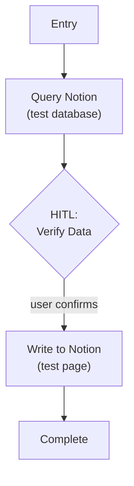

# Step 0b: Notion Tool Layer

## Goal

Validate the Notion Tool Layer — connect, query, display, and write back.

## Prerequisites

Step 0a complete (project structure, checkpoint store, HITL helpers, CLI shell).

## What You're Building

| File | Purpose |
|------|---------|
| `src/weekforge/tools/notion_api_gateway.py` | Generic Notion tool layer (query, fetch, create, update) |
| `src/weekforge/config/env.py` | Environment loading + startup validation |
| `src/weekforge/workflows/notion_test.py` | Test workflow: query Notion -> HITL verify -> write back |

## Specification

### Interface Contracts

All types use typed data structures. The tool layer is Tier-0 — pure deterministic code, no LLM involvement.

**query(database_id, filters) -> list[record]**

| Parameter | Type | Description |
|-----------|------|-------------|
| `database_id` | `string` | Notion database identifier |
| `filters` | `list[filter_condition]` | Property-based filter conditions |
| **Returns** | `list[record]` | Structured records with typed property values |

Pagination is handled internally — callers always receive the complete result set.

**fetch(page_id) -> page**

| Parameter | Type | Description |
|-----------|------|-------------|
| `page_id` | `string` | Notion page identifier |
| **Returns** | `page` | `{ properties: map[string, typed_value], content: list[block] }` |

Block content is parsed from Notion's block tree into a flat, typed list. `to_do` blocks preserve their checked state.

**create(database_id, properties, content) -> page_id**

| Parameter | Type | Description |
|-----------|------|-------------|
| `database_id` | `string` | Target database |
| `properties` | `map[string, typed_value]` | Typed property values matching database schema |
| `content` | `string` (markdown) | Page body as markdown, converted to Notion blocks internally |
| **Returns** | `string` | Created page ID |

**update(page_id, properties?, content?) -> void**

| Parameter | Type | Description |
|-----------|------|-------------|
| `page_id` | `string` | Target page |
| `properties` | `map[string, typed_value]` (optional) | Properties to update (partial) |
| `content` | `string` (markdown, optional) | Replacement body content |

Update operations are **idempotent** — same data multiple times produces the same result. Critical for crash safety.

### Error Contract

| Error Category | Description | Tool Layer Behavior |
|---------------|-------------|--------------------|
| `not_found` | Page or database does not exist | Return error immediately |
| `rate_limited` | Notion API rate limit hit | Retry with exponential backoff (1s -> 2s -> 4s), transparent to caller |
| `auth_failed` | Invalid or expired token | Return error immediately — unrecoverable |
| `api_error` | Other Notion API errors | Return error with original message |

Rate limiting is the only error with automatic retry. All other errors surface to the calling node.

### Test Workflow



- Plain function: query -> HITL verify (using `hitl.py` helpers) -> write
- Query a test database, display results via Rich table
- Write a test page back to Notion
- Validate all four CRUD operations work

### Environment Variables

```
# .env.template additions
NOTION_TOKEN=your_notion_integration_token_here
```

Startup validation now checks `NOTION_TOKEN` is present and non-empty.

## Acceptance Criteria

- [x] `NOTION_TOKEN` loaded from `.env`, validated at startup
- [x] `query()` returns structured records from a real Notion database
- [x] `fetch()` returns page properties + block content
- [x] `create()` writes a new page, returns page ID
- [x] `update()` modifies an existing page idempotently
- [x] Rate limiting handled transparently (backoff + retry)
- [x] Test workflow: read from Notion, display via Rich table, write back, verify in Notion UI
- [x] Checkpoint persistence works across terminal sessions

## Reference

- [Architecture](../reference/architecture.md) — Notion Tool Layer design principles
- [Failure Modes](../reference/failure-modes.md) — Notion API failure handling
