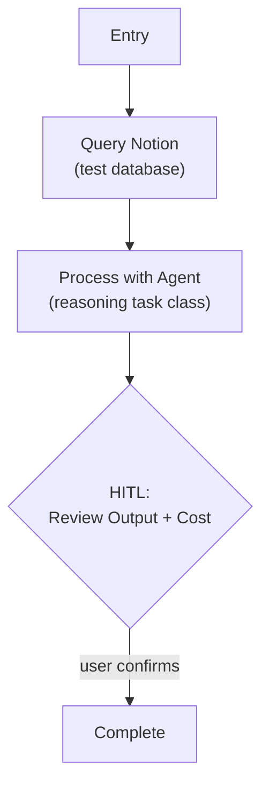

# Step 0c: LLM Integration

## Goal

Validate the Pydantic AI agent setup — call an LLM via a Pydantic AI agent, capture response metadata, display cost (tokens + latency, euro estimation added last).

## Prerequisites

Step 0b complete (Notion tool layer, env loading).

## Implementation Split (4 Sequential Parts)

Step-0c is implemented in four parts, each independently verifiable:

1. **Part 1 — Model Config Layer** (Python profile registry + `.env` selection + `resolve_llm_profile`)
2. **Part 2 — Agent + Cost Infrastructure** (`e2e_agent`, `CallMetadata`, `RunCost`)
3. **Part 3 — Test Workflow + CLI** (end-to-end `weekforge e2e`)
4. **Part 4 — Euro Cost Estimation** (`pricing.py`, per-model rates, EUR in summary)

## What You're Building

| File | Part | Purpose |
|------|------|---------|
| `src/weekforge/config/llm_profiles.py` | 1 | `LLMProfile` dataclass + `LLM_PROFILES` registry |
| `src/weekforge/config/env.py` | 1 | Extended Settings with API key + profile selection |
| `src/weekforge/config/llm_profiles.py` | 1 | `resolve_llm_profile(task_class)` resolver |
| `src/weekforge/agents/__init__.py` | 2 | Package marker |
| `src/weekforge/agents/ (e2e_agent.py, openai_model_factory.py, agent_run_with_metadata.py, prompt_composer.py)` | 2 | Agent instances + `run_with_metadata` wrapper |
| `src/weekforge/models/llm_call_cost.py` | 2, 4 | `CallMetadata`, `RunCost` (extended with EUR in P4) |
| `src/weekforge/workflows/e2e.py` | 3 | E2E validation workflow: Notion → agent → HITL → write |
| `src/weekforge/cli.py` | 3 | Extended with `e2e` command (supersedes `llm-test`) |
| `src/weekforge/models/pricing.py` | 4 | Per-model USD rates, `estimate_cost_eur` |

## Specification

### Model Configuration

Weekforge uses Pydantic AI for LLM integration. Model configuration is layered:

- **`src/weekforge/config/llm_profiles.py`** — registry of model *profiles* as a Python dict. Each profile bundles provider + model + optional per-model knobs (`temperature`, `reasoning_effort`). Edit this to add a profile or tune params. A Python module (instead of YAML) gives us type-checking on every field, no extra dependencies, no package-data build config, and no path resolution — the "config" is still physically separated from the resolver logic.
- **`.env`** — selects which profile each task class uses. Edit this to swap models without touching the profile registry.

**Task classes** (the interface agent code uses — never references model names directly):

| Task Class | Purpose | Default Profile / Model |
|-----------|---------|-------------------------|
| `fast` | Routing, classification, lightweight decisions | `gpt-5.4-nano` |
| `reasoning` | Planning, generation, synthesis | `gpt-5.4` |

Profile keys are the OpenAI model IDs — no separate naming layer until we actually need multiple tunings of the same model (then suffix them, e.g. `gpt-5.4-creative`).

**Profile registry (`src/weekforge/config/llm_profiles.py`):**

```python
from dataclasses import dataclass
from typing import Literal


@dataclass(frozen=True)
class LLMProfile:
    provider: str
    model: str
    temperature: float | None = None
    reasoning_effort: Literal["low", "medium", "high"] | None = None


LLM_PROFILES: dict[str, LLMProfile] = {
    "gpt-5.4-nano": LLMProfile(
        provider="openai",
        model="gpt-5.4-nano",
        temperature=0.1,
    ),
    "gpt-5.4": LLMProfile(
        provider="openai",
        model="gpt-5.4",
        reasoning_effort="medium",
    ),
}
```

Note: `gpt-5.4` is a reasoning model — OpenAI ignores `temperature` for it. The relevant knob is `reasoning_effort` (maps to `openai_reasoning_effort` in Pydantic AI). Keep `temperature` for non-reasoning models; use `reasoning_effort` for reasoning models; leave the other field `None`.

**Endpoint selection is coupled to this mutex.** Reasoning profiles (`reasoning_effort` set) must use OpenAI's **Responses API** (`OpenAIResponsesModel` → `/v1/responses`) — Chat Completions rejects function tools + `reasoning_effort`, and Pydantic AI uses function tools for structured output (`output_type`). Non-reasoning profiles use `OpenAIChatModel` → `/v1/chat/completions`. `agents/openai_model_factory.py` branches on `spec.reasoning_effort is not None` to pick the right model class.

**Profile selection (`.env`):**

```env
OPENAI_API_KEY=your_openai_api_key_here
FAST_PROFILE=gpt-5.4-nano
REASONING_PROFILE=gpt-5.4
```

`.env` overrides are optional — defaults live in the Pydantic Settings class.

**Resolution (`src/weekforge/config/llm_profiles.py`):**

```python
from typing import Literal

from weekforge.config.env import settings
from weekforge.config.llm_profiles import LLM_PROFILES, LLMProfile


def resolve_llm_profile(task_class: Literal["fast", "reasoning"]) -> LLMProfile:
    """Resolve task class -> profile name (from settings) -> LLMProfile."""
    profile_name = getattr(settings, f"{task_class}_profile")
    if profile_name not in LLM_PROFILES:
        raise KeyError(
            f"Model profile {profile_name!r} not found. "
            f"Available: {sorted(LLM_PROFILES)}"
        )
    return LLM_PROFILES[profile_name]
```

Swapping a model = change `.env`. Tweaking a profile's params = edit `profiles.py`. Agent code references task classes only.

### Agent Definitions

Each domain task gets its own Pydantic AI `Agent` instance with a specific system prompt and `output_type`. The agent is built from a `LLMProfile` — provider, model, and whichever params the spec declares are wired in at construction. Because `temperature` and `reasoning_effort` are mutually-exclusive per model family, include only the non-`None` fields:

```python
from pydantic import BaseModel
from pydantic_ai import Agent
from pydantic_ai.models.openai import (
    OpenAIChatModel, OpenAIResponsesModel, OpenAIChatModelSettings, OpenAIResponsesModelSettings,
)
from pydantic_ai.providers.openai import OpenAIProvider
from weekforge.config.env import settings
from weekforge.config.llm_profiles import resolve_llm_profile


class ProcessorResult(BaseModel):
    summary: str


spec = resolve_llm_profile("reasoning")
provider = OpenAIProvider(api_key=settings.openai_api_key)

if spec.reasoning_effort is not None:
    model = OpenAIResponsesModel(spec.model, provider=provider)
    model_settings: OpenAIResponsesModelSettings = {"openai_reasoning_effort": spec.reasoning_effort}
else:
    model = OpenAIChatModel(spec.model, provider=provider)
    chat_settings: OpenAIChatModelSettings = {}
    if spec.temperature is not None:
        chat_settings["temperature"] = spec.temperature
    model_settings = chat_settings

e2e_agent = Agent(
    model=model,
    model_settings=model_settings,
    system_prompt="You are a test processor...",
    output_type=ProcessorResult,
)
```

`ProcessorResult` is the minimum structured-output shape for Part 2 — enough to validate the config-resolution + Pydantic AI wiring. Richer result types land with the domain workflows that need them.

Agents are defined in `agents/ (e2e_agent.py, openai_model_factory.py, agent_run_with_metadata.py, prompt_composer.py)`. Workflows call them via `run_with_metadata(agent, prompt)` (see below) — a thin `run_sync` wrapper that captures tokens + latency in one step.

**Prompt-style composition.** Every agent's `system_prompt` is routed through the composer defined in [reference/prompt-style.md](../reference/prompt-style.md). When `CAVEMAN_MODE` is disabled (default), the base prompt is used verbatim; when enabled, the caveman-lite directive is appended. See the reference doc for the exact directive text and design rationale.

### Response Metadata

Every LLM call captures metadata from Pydantic AI's `result.usage()` (Pydantic AI ≥ 1.0 API — field names are `input_tokens` / `output_tokens`):

| Field | Source | Description |
|-------|--------|-------------|
| `input_tokens` | `result.usage().input_tokens` | Prompt token count |
| `output_tokens` | `result.usage().output_tokens` | Completion token count |
| `latency_ms` | `run_with_metadata()` wrapper in `agents/agent_run_with_metadata.py` | Wall-clock time for the call |
| `model_used` | `agent.model.model_name` | Actual model identifier |
| `cost_eur` | `estimate_cost_eur(model, in, out)` | Euro cost (added in Part 4; `0.0` until then) |

```python
def run_with_metadata(
    agent: Agent,
    prompt: str,
    message_history: list[ModelMessage] | None = None,
) -> tuple[AgentRunResult, CallMetadata, list[ModelMessage]]:
    """Wraps agent.run_sync() with perf_counter timing; returns typed result,
    metadata, and the full message history (for feedback-loop reuse)."""
```

The optional `message_history` + third return value enable multi-turn feedback
loops (step 0d): the workflow persists the message list across HITL pauses and
replays it on the next agent call so the model sees its own prior output.

### Run-Level Cost Accumulation

A `RunCost` dataclass accumulates metadata from every agent call during a workflow run. The CLI displays the total at run completion.

```python
@dataclass
class RunCost:
    total_input_tokens: int = 0
    total_output_tokens: int = 0
    call_count: int = 0
    total_latency_ms: int = 0
    total_cost_eur: float = 0.0  # populated once Part 4 lands

    def add(self, meta: CallMetadata) -> None: ...
    def summary(self) -> str: ...  # Rich-markup line; callers wrap in their own Panel
```

### Test Workflow



- Load data from Notion, pass to a Pydantic AI agent with a simple prompt
- Agent returns a structured `result_type` (validated by Pydantic)
- Capture response metadata, accumulate into `RunCost`
- HITL panel shows agent output + run cost summary
- Validate profile switching works: change `FAST_PROFILE` in `.env` → different model used

### Euro Cost Estimation (Part 4)

`models/pricing.py` provides a per-model pricing table and an estimator:

```python
PRICING: dict[str, tuple[float, float]] = {
    # model_id: (input_usd_per_mtok, output_usd_per_mtok)
    "gpt-5.4":       (2.50, 15.00),
    "gpt-5.4-nano":  (0.20,  1.25),
}
USD_TO_EUR: float = 0.92  # static; may be env-overridable later

def estimate_cost_eur(model: str, input_tokens: int, output_tokens: int) -> float:
    """Unknown model -> 0.0 + warning log (pricing drift shouldn't crash runs)."""
```

`CallMetadata` construction calls `estimate_cost_eur` and stores the result. `RunCost.summary()` displays EUR total.

### Environment Variables

```env
# .env.template additions
OPENAI_API_KEY=your_openai_api_key_here

# Optional: override default profile selection
FAST_PROFILE=gpt-5.4-nano
REASONING_PROFILE=gpt-5.4
```

Pydantic AI reads `OPENAI_API_KEY` from the environment automatically for OpenAI models. Missing `OPENAI_API_KEY` fails fast at import (same pattern as `NOTION_TOKEN`).

## Acceptance Criteria

### Part 1 — Model Config Layer
- [x] `src/weekforge/config/llm_profiles.py` defines `LLMProfile` + `LLM_PROFILES` dict with `gpt-5.4-nano` and `gpt-5.4` entries
- [x] `LLMProfile` carries optional `temperature` and `reasoning_effort` (mutually exclusive per model family)
- [x] Settings extended: `openai_api_key`, `fast_profile`, `reasoning_profile`
- [x] `resolve_llm_profile("fast")` returns a `LLMProfile` for the configured profile
- [x] Missing `OPENAI_API_KEY` fails at import with a clear message
- [x] Invalid profile name raises a `KeyError` listing available profiles

### Part 2 — Agent + Cost Infrastructure
- [x] `e2e_agent` constructs from `resolve_llm_profile("reasoning")` with only the non-`None` model-settings fields wired in (temperature OR reasoning_effort, not both)
- [x] `e2e_agent`'s `system_prompt` is composed via the prompt-style composer described in [reference/prompt-style.md](../reference/prompt-style.md) (baseline: `CAVEMAN_MODE=false` leaves the prompt unchanged)
- [x] `CallMetadata` dataclass defined (`input_tokens` / `output_tokens` matching Pydantic AI `RunUsage`)
- [x] `RunCost.add()` accumulates correctly (unit-testable with fake metadata)
- [x] `RunCost.summary()` renders tokens + latency as a Rich-markup string (no euro yet)
- [x] `run_with_metadata(agent, prompt)` wraps `agent.run_sync()` and produces `CallMetadata` via `result.usage()` + `perf_counter` timing

### Part 3 — Test Workflow + CLI
- [x] E2E workflow queries Notion, calls `e2e_agent` via `run_with_metadata()`, returns structured output
- [x] Response metadata captured via `result.usage()` + timing wrapper
- [x] `weekforge e2e` runs end-to-end against the real OpenAI API
- [x] HITL panel shows agent output + run cost
- [x] Checkpoint save/resume works (same pattern as step-0a/0b)
- [x] Changing a profile in `.env` switches the actual model used
- [x] `uv run ruff check .` and `uv run mypy src/` pass

### Part 4 — Euro Cost Estimation
- [x] `PRICING` dict seeded with `gpt-5.4` and `gpt-5.4-nano` rates
- [x] `estimate_cost_eur` handles unknown models gracefully (returns `0.0` + warning)
- [x] `CallMetadata.cost_eur` populated at construction time
- [x] `RunCost.total_cost_eur` accumulates; `summary()` includes EUR total
- [x] `weekforge e2e` summary shows euro cost alongside tokens + latency

## Reference

- [Architecture](../reference/architecture.md) — Model Configuration Layer, Response Metadata
