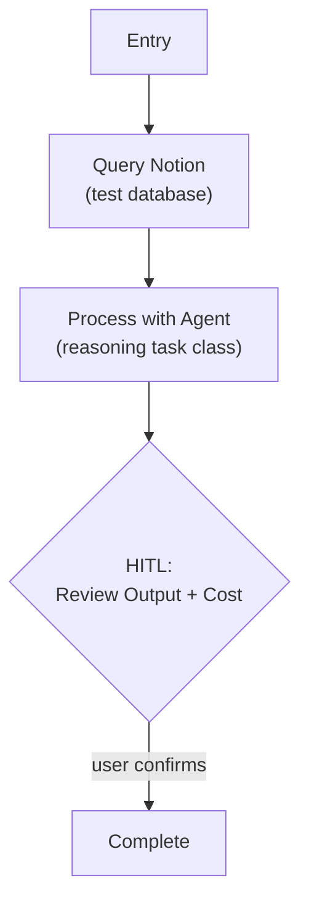

# Step 0c: LLM Integration

## Goal

Validate the Pydantic AI agent setup — call an LLM via a Pydantic AI agent, capture response metadata, display cost (tokens + latency, euro estimation added last).

## Prerequisites

Step 0b complete (Notion tool layer, env loading).

## Implementation Split (4 Sequential Parts)

Step-0c is implemented in four parts, each independently verifiable:

1. **Part 1 — Model Config Layer** (YAML profiles + `.env` selection + `get_model_spec`)
2. **Part 2 — Agent + Cost Infrastructure** (`test_agent`, `CallMetadata`, `RunCost`)
3. **Part 3 — Test Workflow + CLI** (end-to-end `weekforge llm-test`)
4. **Part 4 — Euro Cost Estimation** (`pricing.py`, per-model rates, EUR in summary)

## What You're Building

| File | Part | Purpose |
|------|------|---------|
| `config/models.yaml` | 1 | Model profile registry (project root) |
| `src/weekforge/config/env.py` | 1 | Extended Settings with API key + profile selection |
| `src/weekforge/config/models.py` | 1 | Profile loader, `get_model_spec(task_class)` |
| `src/weekforge/agents/__init__.py` | 2 | Package marker |
| `src/weekforge/agents/agents.py` | 2 | Agent instances for each task type |
| `src/weekforge/models/cost.py` | 2, 4 | `CallMetadata`, `RunCost` (extended with EUR in P4) |
| `src/weekforge/workflows/llm_test.py` | 3 | Test workflow: Notion → agent → HITL |
| `src/weekforge/cli.py` | 3 | Extended with `llm-test` command |
| `src/weekforge/models/pricing.py` | 4 | Per-model USD rates, `estimate_cost_eur` |

## Specification

### Model Configuration

Weekforge uses Pydantic AI for LLM integration. Model configuration is layered:

- **`config/models.yaml`** — registry of model *profiles*. Each profile bundles provider + model + per-model knobs (temperature, plus any future provider-specific params). Edit this to add a profile or tune params.
- **`.env`** — selects which profile each task class uses. Edit this to swap models without touching YAML.

**Task classes** (the interface agent code uses — never references model names directly):

| Task Class | Purpose | Default Profile | Default Model |
|-----------|---------|-----------------|---------------|
| `fast` | Routing, classification, lightweight decisions | `gpt5-nano-fast` | `gpt-5.4-nano` |
| `reasoning` | Planning, generation, synthesis | `gpt5-reasoning` | `gpt-5.4` |

**Profile registry (`config/models.yaml`):**

```yaml
profiles:
  gpt5-nano-fast:
    provider: openai
    model: gpt-5.4-nano
    temperature: 0.1
  gpt5-reasoning:
    provider: openai
    model: gpt-5.4
    temperature: 0.7
  # Future: anthropic profiles, alternate temps, reasoning-mini, etc.
```

**Profile selection (`.env`):**

```env
OPENAI_API_KEY=your_openai_api_key_here
FAST_PROFILE=gpt5-nano-fast
REASONING_PROFILE=gpt5-reasoning
```

`.env` overrides are optional — defaults live in the Pydantic Settings class.

**Resolution (`config/models.py`):**

```python
@dataclass(frozen=True)
class ModelSpec:
    provider: str
    model: str
    temperature: float

def get_model_spec(task_class: Literal["fast", "reasoning"]) -> ModelSpec:
    """Resolve task class -> profile name (from settings) -> ModelSpec (from YAML)."""
    profile_name = getattr(settings, f"{task_class}_profile")
    return load_profiles()[profile_name]
```

Swapping a model = change `.env`. Tweaking a profile's params = change YAML. Agent code references task classes only.

### Agent Definitions

Each domain task gets its own Pydantic AI `Agent` instance with a specific system prompt and `result_type`. The agent is built from a `ModelSpec` — provider, model, and temperature wired in at construction:

```python
from pydantic_ai import Agent
from weekforge.config.models import get_model_spec

spec = get_model_spec("reasoning")
test_agent = Agent(
    model=f"{spec.provider}:{spec.model}",
    model_settings={"temperature": spec.temperature},
    system_prompt="You are a test processor...",
    result_type=ProcessedResult,
)
```

Agents are defined in `agents/agents.py`. Workflows import and call them via `agent.run_sync()` (synchronous — consistent with the existing plain-`def` workflow pattern).

### Response Metadata

Every LLM call captures metadata from Pydantic AI's `result.usage()` (Pydantic AI ≥ 0.0.14 API):

| Field | Source | Description |
|-------|--------|-------------|
| `request_tokens` | `result.usage().request_tokens` | Prompt token count |
| `response_tokens` | `result.usage().response_tokens` | Completion token count |
| `latency_ms` | `time.perf_counter()` wrapper | Wall-clock time for the call |
| `model_used` | `get_model_spec(...).model` | Actual model identifier |
| `cost_eur` | `estimate_cost_eur(model, in, out)` | Euro cost (added in Part 4; `0.0` until then) |

### Run-Level Cost Accumulation

A `RunCost` dataclass accumulates metadata from every agent call during a workflow run. The CLI displays the total at run completion.

```python
@dataclass
class RunCost:
    total_input_tokens: int = 0
    total_output_tokens: int = 0
    call_count: int = 0
    total_latency_ms: int = 0
    total_cost_eur: float = 0.0  # populated once Part 4 lands

    def add(self, meta: CallMetadata) -> None: ...
    def summary(self) -> str: ...  # Rich-renderable
```

### Test Workflow



- Load data from Notion, pass to a Pydantic AI agent with a simple prompt
- Agent returns a structured `result_type` (validated by Pydantic)
- Capture response metadata, accumulate into `RunCost`
- HITL panel shows agent output + run cost summary
- Validate profile switching works: change `FAST_PROFILE` in `.env` → different model used

### Euro Cost Estimation (Part 4)

`models/pricing.py` provides a per-model pricing table and an estimator:

```python
PRICING: dict[str, tuple[float, float]] = {
    # model_id: (input_usd_per_mtok, output_usd_per_mtok)
    "gpt-5.4":       (2.50, 15.00),
    "gpt-5.4-nano":  (0.20,  1.25),
}
USD_TO_EUR: float = 0.92  # static; may be env-overridable later

def estimate_cost_eur(model: str, input_tokens: int, output_tokens: int) -> float:
    """Unknown model -> 0.0 + warning log (pricing drift shouldn't crash runs)."""
```

`CallMetadata` construction calls `estimate_cost_eur` and stores the result. `RunCost.summary()` displays EUR total.

### Environment Variables

```env
# .env.template additions
OPENAI_API_KEY=your_openai_api_key_here

# Optional: override default profile selection
FAST_PROFILE=gpt5-nano-fast
REASONING_PROFILE=gpt5-reasoning
```

Pydantic AI reads `OPENAI_API_KEY` from the environment automatically for OpenAI models. Missing `OPENAI_API_KEY` fails fast at import (same pattern as `NOTION_TOKEN`).

## Acceptance Criteria

### Part 1 — Model Config Layer
- [ ] `config/models.yaml` defines `gpt5-nano-fast` and `gpt5-reasoning` profiles
- [ ] Settings extended: `openai_api_key`, `fast_profile`, `reasoning_profile`
- [ ] `get_model_spec("fast")` returns a `ModelSpec` for the configured profile
- [ ] Missing `OPENAI_API_KEY` fails at import with a clear message
- [ ] Invalid profile name raises a clear error
- [ ] `pyyaml` added to `pyproject.toml`

### Part 2 — Agent + Cost Infrastructure
- [ ] `test_agent` constructs from `get_model_spec("reasoning")` (provider + model + temperature wired in)
- [ ] `CallMetadata` dataclass defined
- [ ] `RunCost.add()` accumulates correctly (unit-testable with fake metadata)
- [ ] `RunCost.summary()` renders tokens + latency (no euro yet)

### Part 3 — Test Workflow + CLI
- [ ] Test workflow queries Notion, calls `test_agent.run_sync()`, returns structured output
- [ ] Response metadata captured via `result.usage()` + timing wrapper
- [ ] `weekforge llm-test` runs end-to-end against the real OpenAI API
- [ ] HITL panel shows agent output + run cost
- [ ] Checkpoint save/resume works (same pattern as step-0a/0b)
- [ ] Changing a profile in `.env` switches the actual model used
- [ ] `uv run ruff check .` and `uv run mypy src/` pass

### Part 4 — Euro Cost Estimation
- [ ] `PRICING` dict seeded with `gpt-5.4` and `gpt-5.4-nano` rates
- [ ] `estimate_cost_eur` handles unknown models gracefully (returns `0.0` + warning)
- [ ] `CallMetadata.cost_eur` populated at construction time
- [ ] `RunCost.total_cost_eur` accumulates; `summary()` includes EUR total
- [ ] `weekforge llm-test` summary now shows euro cost alongside tokens + latency

## Reference

- [Architecture](../reference/architecture.md) — Model Configuration Layer, Response Metadata
