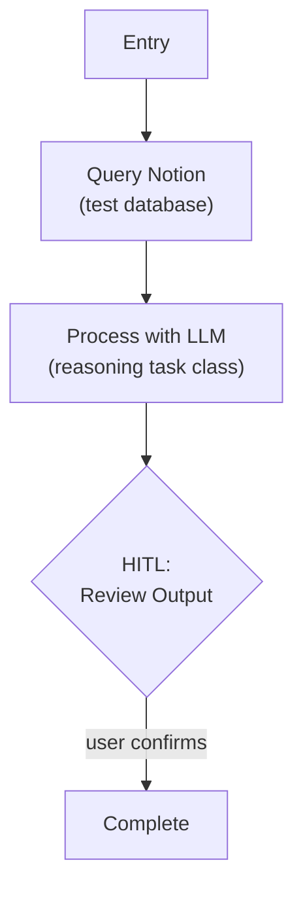

# Step 0c: LLM Integration

## Goal

Validate the Model Configuration Layer — call an LLM via LangGraph-native model binding, capture response metadata, display cost.

## Prerequisites

Step 0b complete (Notion tool layer, env loading).

## What You're Building

| File | Purpose |
|------|---------|
| `src/weekforge/config/models.py` | Model configuration layer — task class -> ChatModel binding |
| `src/weekforge/graph/llm_test.py` | Test graph: Notion data -> LLM processing -> HITL review |

## Specification

### Model Configuration

Weekforge uses LangGraph-native model binding — nodes bind to LangChain `ChatModel` instances directly. No custom LLM wrapper.

**Task classes** (the interface developers use when configuring nodes):

| Task Class | Purpose | Default Model |
|-----------|---------|---------------|
| `fast` | Routing, classification, lightweight decisions | `gpt-5.4-nano` |
| `reasoning` | Planning, generation, synthesis | `gpt-5.4` |

Configuration file (`config/models.yaml` or similar):

```yaml
models:
  fast:
    provider: openai
    model: gpt-5.4-nano
    reasoning: medium
    temperature: 0.1
  reasoning:
    provider: openai
    model: gpt-5.4
    reasoning: medium
    temperature: 0.7
```

Swapping a model means changing one config entry. Node code references task classes, never specific model names.

### Response Metadata

Every LLM call must capture and return:

| Field | Type | Description |
|-------|------|-------------|
| `model_used` | `string` | Actual model identifier |
| `latency_ms` | `integer` | Wall-clock time for the call |
| `input_tokens` | `integer` | Prompt token count |
| `output_tokens` | `integer` | Completion token count |
| `estimated_cost` | `float` | Estimated cost in USD |

### Run-Level Cost Accumulation

A `run_cost` field in graph state accumulates estimated cost from every LLM call during a run. The CLI displays total cost at run completion.

### Test Graph



- Load data from Notion, pass to LLM with a simple prompt
- Capture and display response metadata (model, tokens, cost)
- Validate model config switching works (change config, get different model)

### Environment Variables

```
# .env.template additions
OPENAI_API_KEY=your_openai_api_key_here

# Optional: Override default model config
# WEEKFORGE_FAST_MODEL=gpt-5.4-nano
# WEEKFORGE_REASONING_MODEL=gpt-5.4
```

## Acceptance Criteria

- [ ] Model config loaded from YAML/config, task classes resolve to ChatModel instances
- [ ] LLM processes Notion data, returns structured output
- [ ] Response metadata captured (model, tokens, latency, cost)
- [ ] `run_cost` accumulates across multiple LLM calls in one run
- [ ] CLI displays cost summary at run completion
- [ ] Changing model config switches the actual model used
- [ ] `OPENAI_API_KEY` validated at startup

## Reference

- [Architecture](../reference/architecture.md) — Model Configuration Layer, Response Metadata
