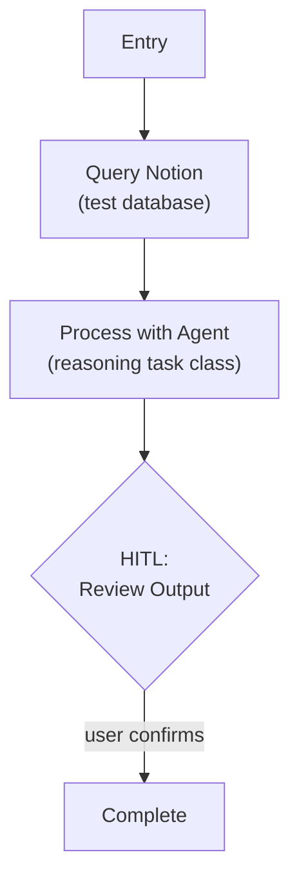

# Step 0c: LLM Integration

## Goal

Validate the Pydantic AI agent setup — call an LLM via a Pydantic AI agent, capture response metadata, display cost.

## Prerequisites

Step 0b complete (Notion tool layer, env loading).

## What You're Building

| File | Purpose |
|------|---------|
| `src/weekforge/config/models.py` | Model configuration layer — task class -> Pydantic AI model string |
| `src/weekforge/agents/__init__.py` | Agent definitions module |
| `src/weekforge/agents/agents.py` | Agent instances for each task type |
| `src/weekforge/workflows/llm_test.py` | Test workflow: Notion data -> agent processing -> HITL review |

## Specification

### Model Configuration

Weekforge uses Pydantic AI for LLM integration. Agents are instantiated with model strings resolved from task class configuration.

**Task classes** (the interface developers use when configuring agents):

| Task Class | Purpose | Default Model |
|-----------|---------|---------------|
| `fast` | Routing, classification, lightweight decisions | `gpt-5.4-nano` |
| `reasoning` | Planning, generation, synthesis | `gpt-5.4` |

Configuration file (`config/models.yaml` or similar):

```yaml
models:
  fast:
    provider: openai
    model: gpt-5.4-nano
    temperature: 0.1
  reasoning:
    provider: openai
    model: gpt-5.4
    temperature: 0.7
```

Task classes resolve to Pydantic AI model strings:

```python
def get_model(task_class: Literal["fast", "reasoning"]) -> str:
    """Returns Pydantic AI model string, e.g. 'openai:gpt-5.4'"""
    config = load_model_config()[task_class]
    return f"{config.provider}:{config.model}"
```

Swapping a model means changing one config entry. Agent code references task classes, never specific model names.

### Agent Definitions

Each domain task gets its own Pydantic AI `Agent` instance with a specific system prompt and `result_type`:

```python
from pydantic_ai import Agent

test_agent = Agent(
    model=get_model("reasoning"),
    system_prompt="You are a test processor...",
    result_type=ProcessedResult,
)
```

Agents are defined in `agents/agents.py`. Workflows import and call them via `agent.run_sync()` (synchronous) or `await agent.run()` (async).

### Response Metadata

Every LLM call captures metadata from Pydantic AI's result object:

| Field | Source | Description |
|-------|--------|-------------|
| `request_tokens` | `result.cost().request_tokens` | Prompt token count |
| `response_tokens` | `result.cost().response_tokens` | Completion token count |
| `latency_ms` | Timing wrapper | Wall-clock time for the call |
| `model_used` | Config resolution | Actual model identifier |
| `estimated_cost` | Token count * pricing | Estimated cost in USD |

### Run-Level Cost Accumulation

A `RunCost` dataclass accumulates estimated cost from every agent call during a workflow run. The CLI displays total cost at run completion.

```python
@dataclass
class RunCost:
    total_input_tokens: int = 0
    total_output_tokens: int = 0
    call_count: int = 0
    total_latency_ms: int = 0
```

### Test Workflow



- Load data from Notion, pass to a Pydantic AI agent with a simple prompt
- Agent returns a structured `result_type` (validated by Pydantic)
- Capture and display response metadata (model, tokens, cost)
- Validate model config switching works (change config, get different model)

### Environment Variables

```
# .env.template additions
OPENAI_API_KEY=your_openai_api_key_here

# Optional: Override default model config
# WEEKFORGE_FAST_MODEL=gpt-5.4-nano
# WEEKFORGE_REASONING_MODEL=gpt-5.4
```

Pydantic AI reads `OPENAI_API_KEY` from the environment automatically for OpenAI models.

## Acceptance Criteria

- [ ] Model config loaded from YAML/config, task classes resolve to Pydantic AI model strings
- [ ] Pydantic AI agent processes Notion data, returns validated structured output
- [ ] Response metadata captured (model, tokens, latency, cost)
- [ ] `RunCost` accumulates across multiple agent calls in one run
- [ ] CLI displays cost summary at run completion
- [ ] Changing model config switches the actual model used
- [ ] `OPENAI_API_KEY` validated at startup
- [ ] `uv run ruff check .` and `uv run mypy src/` pass

## Reference

- [Architecture](../reference/architecture.md) — Model Configuration Layer, Response Metadata
