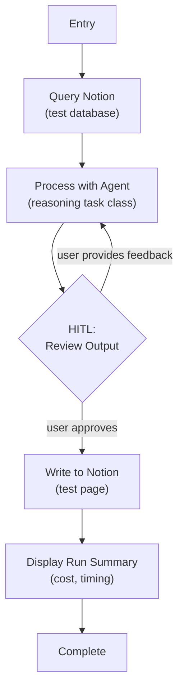

# Step 0d: End-to-End Loop

## Goal

All infrastructure working together — Notion read -> agent process -> HITL feedback loop -> Notion write. This is the Phase 0 exit gate.

## Prerequisites

Step 0c complete (model config, Pydantic AI agents, metadata capture).

## What You're Building

| File | Purpose |
|------|---------|
| `src/weekforge/workflows/e2e.py` | Full end-to-end validation workflow with feedback loop |
| `src/weekforge/agents/agent_run_with_metadata.py` | Extended: accept `message_history`, return updated messages |
| `src/weekforge/hitl.py` | Extended: three-way prompt (approve / feedback / quit) |
| Updates to `cli.py` | Finalize command structure, remove stepwise test commands (`echo`, `notion-test`, `llm-test`); add `e2e`, `plan`/`summarize` placeholders, `continue` |

## Specification

### End-to-End Workflow



- Full loop: read -> process -> review -> write
- HITL feedback loop: approve, provide feedback to re-process, or quit to pause
- Feedback is passed back to the agent via `message_history` to maintain conversational context across iterations
- Message history persists across HITL pauses via `ModelMessagesTypeAdapter.dump_python(..., mode="json")` / `validate_python` — close terminal mid-run and the next resume still sees prior turns
- Checkpoint persistence across terminal sessions (close terminal mid-HITL, resume later)
- Run cost accumulation and display at completion
- Startup validation for all secrets and config — Pydantic `ValidationError` is caught in the CLI callback and rendered as a Rich panel listing the missing variables

### Feedback Loop Pattern

```python
feedback = None
while True:
    result = agent.run_sync(
        user_prompt=format_prompt(data, feedback),
        message_history=prev_messages,
    )
    prev_messages = result.all_messages()
    
    decision = hitl_review(result.data, checkpoint, ...)
    if decision.approved:
        break
    feedback = decision.feedback
```

The agent sees its previous output and the user's feedback, enabling iterative refinement. This pattern is reused in Steps 2 and 3.

### CLI Finalization

| Command | Behavior |
|---------|----------|
| `weekforge` | Show available commands + active checkpoint status if a run exists |
| `weekforge e2e` | **Transitional** — Phase-0 validation workflow. Subsumed by `summarize` in step 1 and removed then. |
| `weekforge plan` | (Placeholder for step 2 — shows "not yet implemented") |
| `weekforge summarize` | (Placeholder for step 1 — shows "not yet implemented") |
| `weekforge continue --thread-id <tid>` | Resume from the last checkpoint (any lifecycle). Dispatches on the `workflow` field of the persisted record. |

Remove the stepwise test commands (`echo`, `notion-test`, `llm-test`) and their workflow modules + tests. They are superseded by the single `e2e` validation command. `e2e` itself is marked transitional and carries no long-term contract — it exists only until step 1 ships the real `summarize` lifecycle.

### HITL Presentation

Every HITL pause renders a Rich panel with three sections:

1. **Context** — What you're looking at (e.g., "Agent processed 3 records from Notion")
2. **Options** — `[a]pprove`, `[f]eedback`, `[q]uit`
3. **Recommendation** — What the system suggests

### Run Summary Display

On completion, show a Rich panel with:
- Total agent calls made
- Total cost accumulated
- Wall-clock time
- Sessions/pages written

## Acceptance Criteria

- [x] Full loop works: Notion query -> agent process -> HITL review -> Notion write
- [x] Feedback loop: providing feedback re-processes with agent (conversation context preserved), re-displays for review
- [x] Checkpoint persistence: close terminal mid-HITL, reopen, resume at same point
- [x] Run summary displayed at completion (cost, timing, calls)
- [x] Startup validation catches missing env vars with clear error
- [x] `weekforge` shows available commands and active checkpoint status
- [x] `weekforge continue` resumes any interrupted run
- [x] Stepwise test commands from 0a-0c removed (`echo`, `notion-test`, `llm-test`); single `e2e` command is the sole validation entry point (transitional, removed in step 1)
- [x] `uv run ruff check .` and `uv run mypy src/` pass

## Reference

- [Architecture](../reference/architecture.md) — CLI architecture, HITL presentation pattern
- [Patterns](../reference/patterns.md) — Checkpoint Store (HITL)
