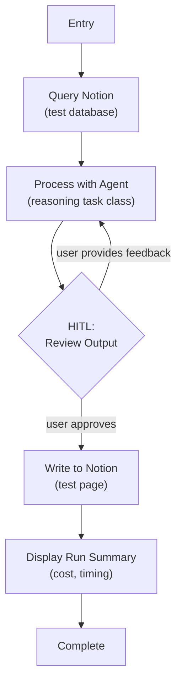

# Step 0d: End-to-End Loop

## Goal

All infrastructure working together — Notion read -> agent process -> HITL feedback loop -> Notion write. This is the Phase 0 exit gate.

## Prerequisites

Step 0c complete (model config, Pydantic AI agents, metadata capture).

## What You're Building

| File | Purpose |
|------|---------|
| `src/weekforge/workflows/e2e.py` | Full end-to-end validation workflow with feedback loop |
| Updates to `cli.py` | Finalize command structure, remove test commands from 0a-0c |

## Specification

### End-to-End Workflow



- Full loop: read -> process -> review -> write
- HITL feedback loop: approve or provide feedback to re-process
- Feedback is passed back to the agent via `message_history` to maintain conversational context across iterations
- Checkpoint persistence across terminal sessions (close terminal mid-HITL, resume later)
- Run cost accumulation and display at completion
- Startup validation for all secrets and config

### Feedback Loop Pattern

```python
feedback = None
while True:
    result = agent.run_sync(
        user_prompt=format_prompt(data, feedback),
        message_history=prev_messages,
    )
    prev_messages = result.all_messages()
    
    decision = hitl_review(result.data, checkpoint, ...)
    if decision.approved:
        break
    feedback = decision.feedback
```

The agent sees its previous output and the user's feedback, enabling iterative refinement. This pattern is reused in Steps 2 and 3.

### CLI Finalization

| Command | Behavior |
|---------|----------|
| `weekforge` | Show available commands + active checkpoint status if a run exists |
| `weekforge plan` | (Placeholder for step 2 — shows "not yet implemented") |
| `weekforge summarize` | (Placeholder for step 1 — shows "not yet implemented") |
| `weekforge continue` | Resume from the last checkpoint (any lifecycle) |

Remove any temporary test commands from steps 0a-0c. The CLI should now have the final command structure, with placeholder messages for features not yet built.

### HITL Presentation

Every HITL pause renders a Rich panel with three sections:

1. **Context** — What you're looking at (e.g., "Agent processed 3 records from Notion")
2. **Options** — `[a]pprove`, `[f]eedback`, `[q]uit`
3. **Recommendation** — What the system suggests

### Run Summary Display

On completion, show a Rich panel with:
- Total agent calls made
- Total cost accumulated
- Wall-clock time
- Sessions/pages written

## Acceptance Criteria

- [ ] Full loop works: Notion query -> agent process -> HITL review -> Notion write
- [ ] Feedback loop: providing feedback re-processes with agent (conversation context preserved), re-displays for review
- [ ] Checkpoint persistence: close terminal mid-HITL, reopen, resume at same point
- [ ] Run summary displayed at completion (cost, timing, calls)
- [ ] Startup validation catches missing env vars with clear error
- [ ] `weekforge` shows available commands and active checkpoint status
- [ ] `weekforge continue` resumes any interrupted run
- [ ] All test/temporary commands from 0a-0c removed
- [ ] `uv run ruff check .` and `uv run mypy src/` pass

## Reference

- [Architecture](../reference/architecture.md) — CLI architecture, HITL presentation pattern
- [Patterns](../reference/patterns.md) — Checkpoint Store (HITL)
