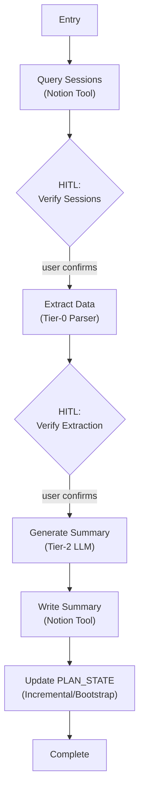

# Step 1: Extraction Subsystem (`summarize_week`)

## Goal

Build the first real feature — post-execution extraction. Summarize a completed training week, generate feedback, and manage PLAN_STATE.

## Prerequisites

Step 0d complete (all infrastructure validated end-to-end).

## What You're Building

| File | Purpose |
|------|---------|
| `src/weekforge/graph/extraction.py` | Extraction graph (Lifecycle B) |
| `src/weekforge/tools/extraction.py` | Feature-specific tool nodes (query sessions, parse blocks) |
| `src/weekforge/models/state.py` | Extend state schema with extraction-specific fields |
| Updates to `cli.py` | Wire `weekforge summarize` command |

## Specification

### Overview

`summarize_week` runs independently and on-demand after the physical training week is complete. It aggregates executed sessions, extracts feedback, calculates adherence, and updates the global PLAN_STATE.

### Graph Topology

### Edge Conditions

| From | To | Condition |
|------|-----|-----------|
| Entry | Query Sessions | Always — fetch all sessions for the target week |
| Query Sessions | HITL Verify Sessions | Sessions found — confirm correct set before extraction |
| HITL Verify Sessions | Extract Data | User confirms |
| Extract Data | HITL Verify Extraction | Data completeness check displayed |
| HITL Verify Extraction | Generate Summary | User confirms extraction is complete |
| Generate Summary | Write Summary | Summary generated (Tier-2 LLM) |
| Write Summary | Update PLAN_STATE | Summary written to Notion |
| Update PLAN_STATE | Complete | PLAN_STATE updated |

### PLAN_STATE

The system's long-range memory — a cumulative mesocycle tracker persisted in Notion across the entire 8-12 week training block. It bridges Lifecycle B (writes it) and Lifecycle A (reads it).

**Contents:** Progression chains for all main lifts (week-over-week weight tracking), injury timeline, adherence trends, deload history, focus exercise coverage gaps, cardio/climbing progression, push/pull balance, session preferences, active vs resolved issues.

**Two creation modes:**
- **Incremental update** — Merge new week's data into existing PLAN_STATE. Each category updated independently.
- **Bootstrap** — If PLAN_STATE doesn't exist, compile from all available weekly summaries in chronological order. Self-healing.

**Storage:** Lives in the `training_week_summaries` Notion database with `Week = "PLAN_STATE"` key.

**Graceful degradation:** If missing when Lifecycle A runs, fall back to 3-week feedback window only. CLI surfaces a warning.

### Data Extraction (Tier-0)

Session data extraction is pure Python (Tier-0):
- Parse Notion `to_do` blocks — extract exercise names, sets/reps/weight, checked state
- Parse comments — extract freeform feedback
- Parse properties — extract session metadata (date, type, duration)
- Week prefix formatting: always zero-padded (`f"W{week_target:02d}"`), computed by tool node

### Failure Handling

- **Query returns 0 sessions:** Week prefix is Tier-0 computed (no format mismatch). If genuinely no sessions, surface to user at HITL.
- **Partial data:** Load what's available, note gaps in extraction display.
- **PLAN_STATE missing for bootstrap:** Compile from all available summaries. If no summaries exist either, create initial empty PLAN_STATE.
- **Notion write failure:** Retry with backoff. Checkpoint preserves state so user can retry without re-generating.

## Acceptance Criteria

- [ ] `weekforge summarize` starts the extraction graph
- [ ] Sessions queried from Notion for the target week
- [ ] HITL: user verifies correct sessions before extraction
- [ ] Tier-0 parser extracts structured data from Notion blocks
- [ ] HITL: user verifies extraction completeness
- [ ] Tier-2 LLM generates weekly summary with feedback
- [ ] Summary written to Notion
- [ ] PLAN_STATE updated (incremental) or created (bootstrap)
- [ ] Checkpoint persistence works across terminal sessions
- [ ] Run cost displayed at completion

## Reference

- [Patterns](../reference/patterns.md) — Parallelization (concurrent context loading)
- [State Schema](../reference/state-schema.md) — Layer B context state
- [Failure Modes](../reference/failure-modes.md) — Data & context failures, Notion API failures
