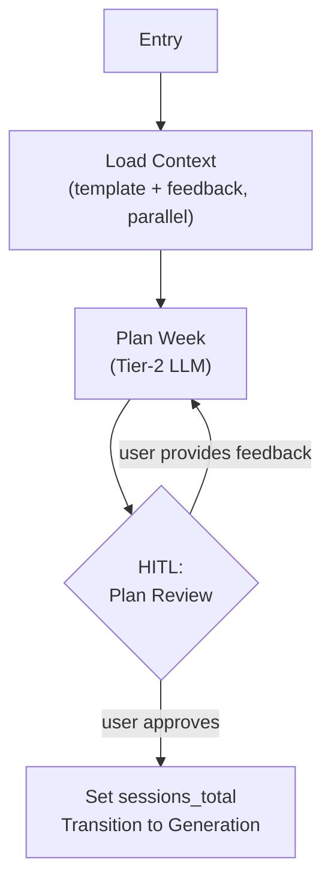

# Step 2: Planning Engine (`plan_week`)

## Goal

Build the macro planner — the first feature requiring HITL feedback loops and checkpoint persistence for collaborative plan shaping.

## Prerequisites

Step 1 complete (extraction subsystem, PLAN_STATE exists).

## What You're Building

| File | Purpose |
|------|---------|
| `src/weekforge/graph/planning.py` | Planning graph (Lifecycle A, part 1) |
| `src/weekforge/tools/planning.py` | Context loading tool nodes (templates, feedback, PLAN_STATE) |
| `src/weekforge/models/state.py` | Extend state with planning-specific fields (Layer A, B, C) |
| Updates to `cli.py` | Wire `weekforge plan` command |

## Specification

### Overview

The user provides `week_target`. The system loads context (templates + feedback in parallel), generates a macro week plan via Tier-2 LLM, and pauses for HITL review. The user can approve or provide feedback to reshape the plan. This collaborative shaping loop repeats until approval.

### Graph Topology (Planning Phase Only)

### Edge Conditions

| From | To | Condition |
|------|-----|-----------|
| Entry | Load Context | Always — first node on every invocation |
| Load Context | Plan Week | Context loaded (template + feedback merged) |
| Plan Week | HITL Plan Review | Always — plan generated, interrupt for review |
| HITL Plan Review | Plan Week | User provides freeform feedback -> re-plan |
| HITL Plan Review | Generation | User approves -> begin generation (step 3) |

### State Fields Used

**Layer A (Workflow):**
- `week_target` — User provides this at invocation

**Layer B (Context, loaded fresh):**
- `template_sessions` — Template sessions fetched from Notion by week prefix
- `feedback_context` — Merged 3-week feedback window + PLAN_STATE, loaded via parallel queries
- `active_flare` — Derived from most recent week's feedback
- `user_profile` — User conditions, goals, preferences
- `guardrails` — Exercise guardrails, progression protocol

**Layer C (Output):**
- `week_plan` — The approved macro plan text
- `sessions_total` — Set on plan approval

### Context Loading (Parallelization)

Template sessions and feedback context are independent Notion queries — fire concurrently via `asyncio.gather`:

1. **Templates:** Query by week prefix (`f"W{week_target:02d}"`)
2. **Feedback window:** Query summaries for weeks N-1, N-2, N-3
3. **PLAN_STATE:** Fetch the cumulative tracker
4. **User profile + guardrails:** Fetch from Notion config pages

Merge results into a single structured context for the LLM.

### Failure Handling

- **PLAN_STATE missing:** Graceful degradation — plan with 3-week feedback window only. CLI warns user to run `weekforge summarize` to rebuild.
- **Partial feedback:** Load what exists, note gaps in context display.
- **Contradictory signals:** Priority order embedded in system prompt. Pain always wins.

## Acceptance Criteria

- [ ] `weekforge plan` starts the planning graph
- [ ] User provides `week_target` (e.g., 7)
- [ ] Context loaded in parallel (templates + feedback + PLAN_STATE + profile)
- [ ] Tier-2 LLM generates macro week plan
- [ ] HITL: user can approve or provide feedback
- [ ] Feedback loop: providing feedback re-generates plan with user input as additional context
- [ ] On approval: `week_plan` and `sessions_total` set in state
- [ ] Graceful degradation if PLAN_STATE missing
- [ ] Checkpoint persistence across terminal sessions
- [ ] Run cost displayed

## Reference

- [Patterns](../reference/patterns.md) — Planning (Collaborative Shaping), Parallelization
- [State Schema](../reference/state-schema.md) — All three layers
- [Failure Modes](../reference/failure-modes.md) — Data & context failures
