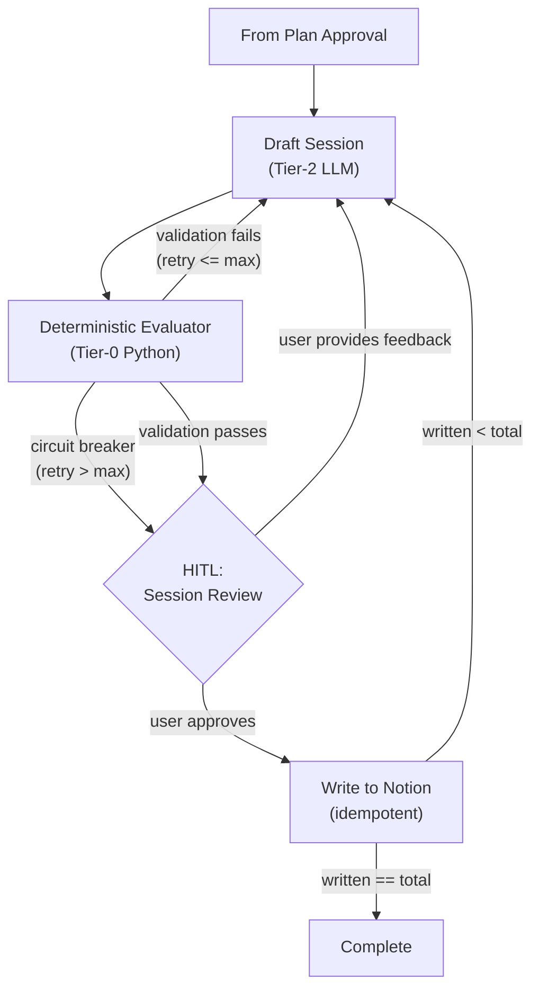

# Step 3: Generative Loop (`draft_session`)

## Goal

Build the iterative session generation loop — draft, evaluate, review, write — the core of Lifecycle A.

## Prerequisites

Step 2 complete (planning engine, approved `week_plan` in state).

## What You're Building

| File | Purpose |
|------|---------|
| `src/weekforge/graph/generation.py` | Generation loop (Lifecycle A, part 2) |
| `src/weekforge/graph/evaluator.py` | Deterministic Evaluator (Tier-0 Python validation) |
| `src/weekforge/tools/generation.py` | Session writing tool nodes (idempotent Notion writes) |
| `src/weekforge/models/state.py` | Extend state with generation-specific fields |

## Specification

### Overview

On plan approval (step 2), the graph automatically loops over the session array. Each session is drafted (Tier-2 LLM), passed through the Deterministic Evaluator (Tier-0 Python), then paused for HITL review. On approval, the session is written to Notion and the next is drafted automatically.

### Graph Topology (Generation Phase)

### Edge Conditions

| From | To | Condition |
|------|-----|-----------|
| Draft Session | Evaluator | Always — every draft is validated |
| Evaluator | Draft Session | Validation fails AND retry count <= max |
| Evaluator | HITL Session Review | Validation passes OR circuit breaker triggers (with warning) |
| HITL Session Review | Draft Session | User provides feedback -> re-draft |
| HITL Session Review | Write to Notion | User approves |
| Write to Notion | Draft Session | `len(written_sessions) < sessions_total` -> next session |
| Write to Notion | Complete | `len(written_sessions) == sessions_total` -> done |

### Deterministic Evaluator (Tier-0, Zero LLM Cost)

Runs automatically after every draft. Pure Python. User never sees a failing draft.

**Structural validation:**
- Checkbox format (`- [ ]`), required fields (Duration, Location, Objective, Intensity, Equipment)
- No plain bullet exercises

**Guardrail enforcement:**
- Flare substitution compliance when `active_flare = True`
- Progression protocol adherence for every returning exercise
- Duration budget (exercises + rest fit session length)
- Focus exercise pacing vs 8+ weekly target

**Context grounding verification:**
- **Template reference:** Reasoning must name the specific template session used, list what was kept vs changed
- **Feedback citation:** Must cite at least one specific data point from feedback with its source week
- **Progression justification:** Each returning exercise: last performed -> signal -> decision path -> new parameters
- **Flare acknowledgment:** If `active_flare = True`, must list substituted exercises and why

The Evaluator checks for **presence and structure** of reasoning, not quality. Quality judgment remains with the human.

**Circuit breaker:** After max retries (e.g., 3), surface the best failing draft to the human with a warning listing what checks failed.

### State Fields Used

**Layer C (Output, accumulated):**
- `current_session_index` — Which session we're drafting (1-based), Replace reducer
- `current_draft` — Current draft being reviewed — ephemeral, Replace reducer
- `written_sessions` — Lightweight references `{page_id, session_name}`, **Append reducer** (critical for checkpoint safety)
- `focus_exercise_count` — Running tally vs 8+ target, Replace reducer

### Idempotent Writes

All Notion writes check if the target session (matching name + week) already exists before creating. This prevents duplicates if the process crashes after a write succeeds but before the checkpoint saves.

### Failure Handling

- **LLM ignores template:** Context grounding verification catches it -> auto-reject
- **LLM skips progression:** Evaluator requires explicit justification -> auto-reject
- **LLM ignores flare:** Evaluator checks substitutions -> auto-reject
- **Malformed format:** Structural validation catches it -> auto-reject
- **Retry storm:** Circuit breaker after max attempts -> surface to human with warning
- **Notion write failure:** Retry with backoff. Checkpoint has the approved draft.

## Acceptance Criteria

- [ ] After plan approval, generation loop starts automatically
- [ ] Tier-2 LLM drafts each session with reasoning block
- [ ] Deterministic Evaluator validates every draft (structural, guardrails, context grounding)
- [ ] Failed validation auto-retries with specific error feedback
- [ ] Circuit breaker triggers after max retries, surfaces draft with warning
- [ ] HITL: user can approve or provide feedback for re-draft
- [ ] Approved sessions written to Notion idempotently
- [ ] `written_sessions` append reducer persists across checkpoint resume
- [ ] Auto-progression: after writing, next session drafts automatically
- [ ] Completion when `len(written_sessions) == sessions_total`
- [ ] Full end-to-end: plan -> approve plan -> draft all sessions -> write all to Notion
- [ ] Progress visualization (`3/8 ████░░░░`)
- [ ] Run cost displayed at completion

## Reference

- [Patterns](../reference/patterns.md) — Evaluator-Optimizer (Two-Stage Validation Gate)
- [State Schema](../reference/state-schema.md) — Layer C output state, reducers
- [Failure Modes](../reference/failure-modes.md) — LLM output failures, circuit breaker
