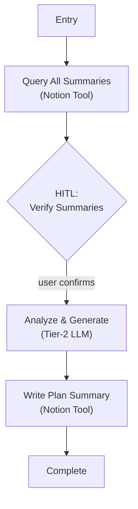

# Step 4: Terminal Review (`summarize_plan`)

## Goal

Build the mesocycle terminal review — aggregate all weekly summaries to analyze macro progressions and persistent patterns across an 8-18 week training block.

## Prerequisites

Step 1 complete (extraction subsystem — weekly summaries must exist in Notion). Steps 2-3 not strictly required, but the training block should be complete.

## What You're Building

| File | Purpose |
|------|---------|
| `src/weekforge/graph/terminal.py` | Terminal review graph (Lifecycle C) |
| `src/weekforge/tools/terminal.py` | Summary aggregation tool nodes |
| Updates to `cli.py` | Wire `weekforge review` command |

## Specification

### Overview

Run independently and on-demand after a prolonged training block (8-12 weeks) is completed. Aggregates all weekly summaries to deduce macro strength progressions and persistent pain patterns.

### Graph Topology

### Edge Conditions

| From | To | Condition |
|------|-----|-----------|
| Entry | Query All Summaries | Always — fetch all weekly summaries |
| Query All Summaries | HITL Verify Summaries | Summaries found — confirm correct set |
| HITL Verify Summaries | Analyze & Generate | User confirms |
| Analyze & Generate | Write Plan Summary | Plan summary generated (Tier-2 LLM) |
| Write Plan Summary | Complete | Written to Notion as `PLAN_SUMMARY` |

### Analysis Scope

The Tier-2 LLM analyzes across all weekly summaries:
- Strength progressions for main lifts (week-over-week trends)
- Persistent pain/injury patterns and their resolution timeline
- Adherence trends and common skip patterns
- Deload effectiveness
- Recommendations for the next training cycle

### Failure Handling

- **No summaries found:** Surface to user at HITL. Cannot proceed without data.
- **Notion write failure:** Retry with backoff. Standard tool layer handling.

This is the simplest graph in the system — no feedback loops, no evaluator, straightforward extension of the Notion tool layer from step 1.

## Acceptance Criteria

- [ ] `weekforge review` starts the terminal review graph
- [ ] All weekly summaries queried from Notion
- [ ] HITL: user verifies correct summary set
- [ ] Tier-2 LLM generates mesocycle analysis with progressions, patterns, recommendations
- [ ] Plan summary written to Notion as `PLAN_SUMMARY`
- [ ] Run cost displayed at completion

## Reference

- [Architecture](../reference/architecture.md) — CLI command structure
- [Failure Modes](../reference/failure-modes.md) — Notion API failures
